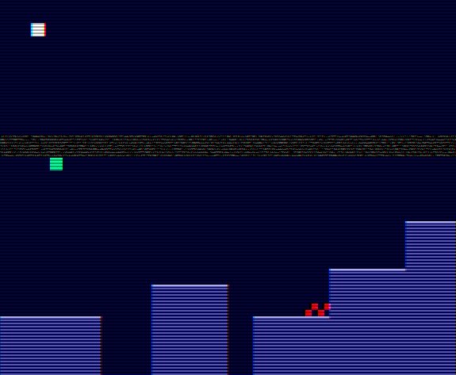

   

# VHS Platformer

- [Read the documentation for project](docs/info.md)

Link to VGA Playground: https://vga-playground.com/?repo=https://github.com/de-rekk/VHS_Platformer/

## How it works

The design implements a complete game engine running directly on silicon:
- **VGA Controller:** Generates stable 640x480 resolution sync signals (`hsync_reg`, `vsync_reg`) at 60Hz.
- **Physics Engine:** Evaluates velocity, gravity, and player coordinates against a hardcoded 64-column map array (`get_floor`, `get_spike`) once per frame tick.
- **VHS Visual Effects:** Utilizes a Linear-Feedback Shift Register (LFSR) for pseudo-random static noise, custom line jitter, and a scrolling tracking band. Pipelined shift registers create hardware-level chromatic aberration (color splitting) along object edges.

## Controls

- **Playground Gamepad:**
  - **D-Pad Left / Right:** Move player horizontally
  - **Up / A / B / X / Y:** Jump
  - **Start / Select:** Start game / Restart after game over
- **Fallback (DIP Switches / `ui_in`):**
  - **0:** Move Left
  - **1:** Move Right
  - **2:** Jump
  - **3 or 7:** Start / Restart
